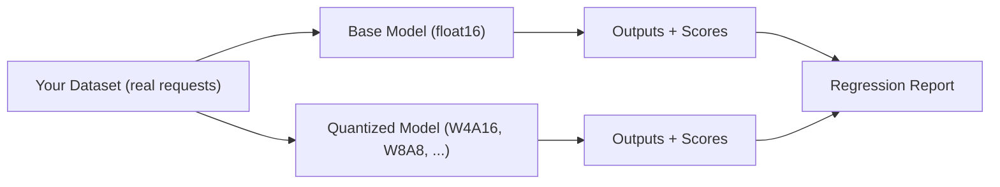

# Quantization Profiler

A toolkit for quantizing HuggingFace LLMs and evaluating the quality impact of quantization on **your** models, data, and workflows.

---

## The Problem

Quantization reduces model size and inference cost, but it is a lossy compression. The quality degradation it introduces is:

- **Model-dependent** -- some architectures tolerate aggressive quantization well; others degrade sharply.
- **Workload-dependent** -- a quantization scheme that works well for general benchmarks may still introduce regressions on your specific task, domain, or output format.
- **Scheme-dependent** -- W4A16, W8A8, AWQ, and FP8 have fundamentally different tradeoffs in accuracy vs. throughput.

Standard public benchmarks (MMLU, HellaSwag, etc.) will not catch regressions in your use case. The only reliable signal is running quantized models against **your own requests and evaluating against your own quality criteria**.

---

## The Goal

This repo provides the infrastructure to:

1. **Quantize** any HuggingFace model into a vLLM-servable checkpoint using a variety of schemes.
2. **Serve** quantized models locally via a vLLM OpenAI-compatible server.
3. **Evaluate** -- run your dataset through a model (base or quantized) and measure quality with metrics that reflect your actual requirements.
4. **Compare** -- surface regressions by diffing quality scores across schemes, models, or configurations, so you can make an informed decision about which quantization is safe to deploy.

The intended workflow is:



---

## Repo Layout

```
src/
  quantizer.py            # Quantize HuggingFace models into cached, vLLM-servable checkpoints
  vllm_server_manager.py  # Start, health-check, and terminate a vLLM server subprocess

tests/
  test_quantizer.py             # Unit and integration tests for Quantizer
  test_vllm_server_manager.py   # Unit and integration tests for VLLMServerManager

notebooks/
  colab_test_drive.ipynb  # End-to-end walkthrough for Colab / GPU environments
```

---

## Current Components

### `Quantizer` (`src/quantizer.py`)

Produces quantized, vLLM-servable checkpoints from any HuggingFace model. Output is written in compressed-tensors format; vLLM auto-detects the quantization config, so no extra flags are needed at serve time.

**Supported schemes:**

| Scheme | Method | Calibration data required |
|---|---|---|
| `W4A16`     | GPTQ                  | Yes |
| `W8A8_INT8` | SmoothQuant + GPTQ      | Yes |
| `AWQ_W4A16` | AWQ + W4A16 asymmetric | Yes |
| `FP8_BLOCK`  | Round-to-nearest FP8 | No  |

Checkpoints are cached on disk (keyed by model, scheme, and calibration config), so repeated runs skip quantization. A crash mid-save never leaves a poisoned cache entry.

### `VLLMServerManager` (`src/vllm_server_manager.py`)

Manages a vLLM OpenAI-compatible API server as a background subprocess. Handles startup, health polling, graceful shutdown, and GPU memory cleanup.

---

## What Is Coming

- **Evaluation runner** -- send a dataset of prompts through any served model and collect responses.
- **Scoring layer** -- pluggable quality metrics (exact match, similarity, LLM-as-judge, task-specific scorers).
- **Regression comparator** -- diff scores across runs (base vs. quantized, scheme vs. scheme) and surface where quality drops.

---

## Running the Tests

Unit tests run without a GPU or ML stack:

```bash
python -m pytest tests/
```

Integration tests require a GPU and the full ML stack:

```bash
# Quantization integration test (requires llm-compressor + GPU)
TEST_QUANT_INTEGRATION=1 python -m pytest tests/test_quantizer.py

# vLLM server integration test (requires vLLM + GPU)
TEST_VLLM_INTEGRATION=1 python -m pytest tests/test_vllm_server_manager.py
```
